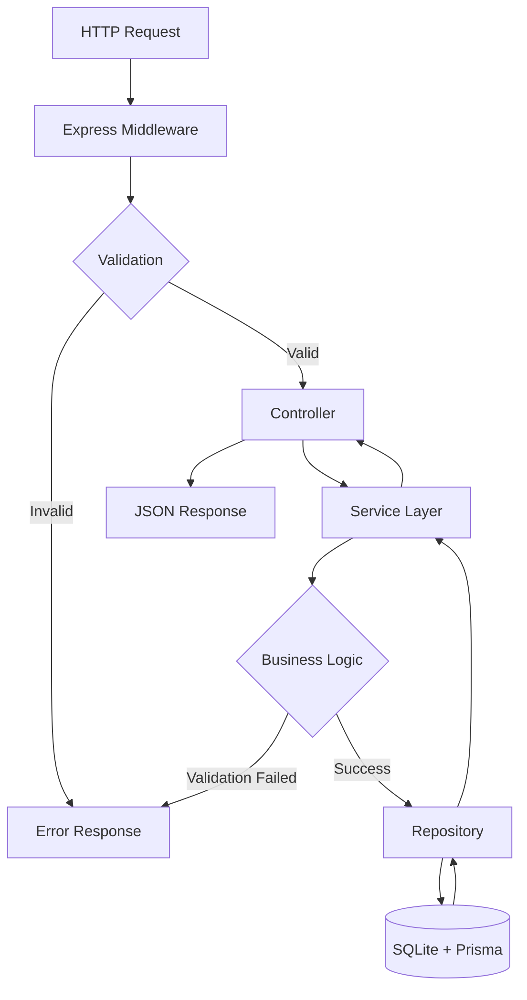
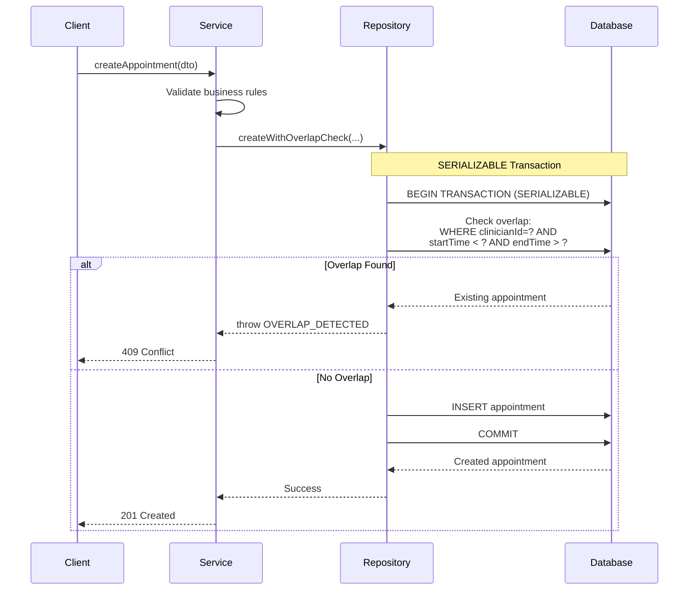
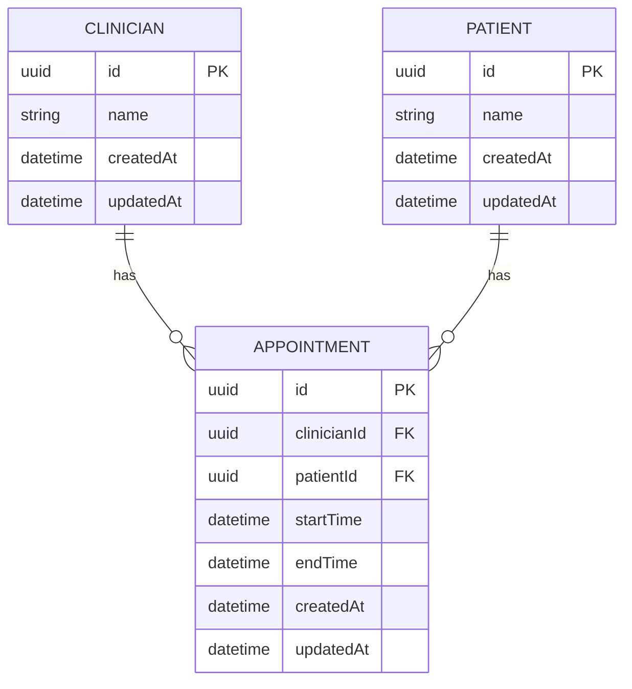

# Clinic Appointment System - Design Document

## Problem

Clinics need a reliable system to manage appointments that prevents scheduling conflicts. The core challenge is **preventing overlapping appointments** for the same clinician while maintaining data integrity under concurrent requests.

## Background

### Requirements

Build a RESTful API for clinic appointment management with the following capabilities:

**Core Endpoints:**
1. `POST /api/appointments` - Create appointments with overlap validation
2. `GET /api/clinicians/{id}/appointments` - View clinician's schedule (with optional date filters)
3. `GET /api/appointments` - Admin view of all appointments (with optional date filters)

**Supporting Endpoints:**
4. `POST /api/clinicians` - Create clinician records
5. `POST /api/patients` - Create patient records
6. `GET /api/clinicians` - List all clinicians
7. `GET /api/patients` - List all patients

**Key Constraints:**
- No overlapping appointments for the same clinician (touching endpoints are allowed)
- Validate: `start < end`, valid ISO datetimes, entities exist, no past appointments
- Role-based access control (patient/clinician/admin)
- Comprehensive test coverage (80%+)

## Proposed Solution

### Architecture Overview



**Layered Architecture:**
- **Controllers**: Handle HTTP, delegate to services
- **Services**: Business logic, validation orchestration
- **Repositories**: Data access, transaction management
- **Middleware**: Auth, validation, error handling

### Critical Flow: Overlap Detection with SERIALIZABLE Transaction

**The key innovation** - preventing race conditions during appointment creation:



**Why SERIALIZABLE matters**: Two concurrent requests both check for overlaps → SERIALIZABLE forces them to run sequentially → second request sees first appointment → conflict detected → no double-booking!

### Data Model



**ORM: Prisma**
- Type-safe database access
- Automatic TypeScript type generation
- Built-in migration support
- Transaction support with configurable isolation levels

**Key Schema Decisions:**
- **UUIDs** for primary keys (better for distributed systems, no sequential guessing)
- **Composite index** on `(clinicianId, startTime, endTime)` for fast overlap queries
- **Cascade deletes** to maintain referential integrity
- **Timestamps** for auditing (createdAt, updatedAt auto-managed by Prisma)

### Request/Response Details

#### POST /api/appointments

**Request:**
```json
{
  "clinicianId": "uuid",
  "patientId": "uuid",
  "startTime": "2024-12-25T10:00:00Z",
  "endTime": "2024-12-25T11:00:00Z"
}
```

**Success Response (201):**
```json
{
  "id": "uuid",
  "clinicianId": "uuid",
  "patientId": "uuid",
  "startTime": "2024-12-25T10:00:00Z",
  "endTime": "2024-12-25T11:00:00Z",
  "createdAt": "2024-12-20T08:00:00Z",
  "updatedAt": "2024-12-20T08:00:00Z",
  "clinician": {
    "id": "uuid",
    "name": "Dr. Smith"
  },
  "patient": {
    "id": "uuid",
    "name": "John Doe"
  }
}
```

**Error Responses:**
- `400 Bad Request` - Invalid input (bad dates, start >= end, invalid UUIDs)
- `404 Not Found` - Clinician or patient doesn't exist
- `409 Conflict` - Appointment overlaps with existing appointment
- `403 Forbidden` - Missing or invalid X-Role header

#### GET /api/clinicians/{id}/appointments

**Query Parameters:**
- `from` (optional): ISO datetime - filter appointments starting after this time
- `to` (optional): ISO datetime - filter appointments ending before this time

**Success Response (200):**
```json
[
  {
    "id": "uuid",
    "clinicianId": "uuid",
    "patientId": "uuid",
    "startTime": "2024-12-25T10:00:00Z",
    "endTime": "2024-12-25T11:00:00Z",
    "createdAt": "2024-12-20T08:00:00Z",
    "updatedAt": "2024-12-20T08:00:00Z",
    "clinician": { "id": "uuid", "name": "Dr. Smith" },
    "patient": { "id": "uuid", "name": "John Doe" }
  }
]
```

**Error Responses:**
- `404 Not Found` - Clinician doesn't exist
- `403 Forbidden` - Wrong role (requires clinician or admin)

#### GET /api/appointments

**Query Parameters:** Same as clinician appointments

**Success Response (200):** Array of all upcoming appointments (same format)

**Error Responses:**
- `403 Forbidden` - Not admin role

### Trade-offs & Design Decisions

#### 1. SERIALIZABLE Transaction Isolation

**Decision:** Use SQLite's SERIALIZABLE isolation level for appointment creation.

**Rationale:**
- Prevents race conditions (phantom reads where two concurrent requests both see no overlap)
- Atomic check-and-insert operation
- Leverages database guarantees instead of application-level locking

**Trade-offs:**
- ✅ **Pro:** Simple, correct, no application-level locks to manage
- ✅ **Pro:** Works correctly even under high concurrency
- ❌ **Con:** Global write lock in SQLite = one write at a time across entire DB
- ❌ **Con:** Can cause contention under very high load

**Cost/Performance:**
- **Latency:** ~5-10ms per appointment creation (local SQLite)
- **Throughput:** Limited by SQLite's single-writer model (~1000 writes/sec theoretical max)
- **Scaling:** Doesn't scale horizontally

**Production Alternative:**
```sql
-- PostgreSQL with row-level locking
BEGIN;
SELECT * FROM appointments
WHERE clinician_id = ? AND start_time < ? AND end_time > ?
FOR UPDATE;  -- Row-level lock, not global
INSERT INTO appointments ...;
COMMIT;
```

#### 2. Overlap Detection Algorithm

**Implementation:**
```typescript
// Two appointments overlap if:
start < other.end && end > other.start

// In Prisma query:
where: {
  clinicianId,
  AND: [
    { startTime: { lt: endTime } },    // other.start < our.end
    { endTime: { gt: startTime } },     // other.end > our.start
  ],
}
```

**Why this works:**
- Catches all overlap cases: partial, full containment, exact match
- Explicitly allows touching endpoints (end === other.start is OK)
- Database index on `(clinicianId, startTime, endTime)` makes this query O(log n)

**Edge Cases Covered:**
| Scenario | Appointment A | Appointment B | Result |
|----------|---------------|---------------|--------|
| Separate | 10:00-11:00 | 12:00-13:00 | ✅ Allowed |
| Touching (end to start) | 10:00-11:00 | 11:00-12:00 | ✅ Allowed |
| Touching (start to end) | 11:00-12:00 | 10:00-11:00 | ✅ Allowed |
| Partial overlap (start) | 10:00-11:00 | 10:30-11:30 | ❌ Rejected |
| Partial overlap (end) | 10:00-11:00 | 09:30-10:30 | ❌ Rejected |
| Fully contained | 10:00-12:00 | 10:30-11:00 | ❌ Rejected |
| Fully containing | 10:30-11:00 | 10:00-12:00 | ❌ Rejected |
| Exact match | 10:00-11:00 | 10:00-11:00 | ❌ Rejected |

#### 3. Role-Based Access Control

**Decision:** Simple header-based auth with `X-Role` header.

**Rationale:**
- Meets bonus requirement
- Easy to test and demonstrate
- Straightforward to extend to JWT later

**Trade-offs:**
- ✅ **Pro:** Simple, no JWT libraries, easy to understand
- ✅ **Pro:** Perfect for demo/assessment context
- ❌ **Con:** Not production-ready (no actual authentication)

**Role Matrix:**
| Endpoint | Patient | Clinician | Admin |
|----------|---------|-----------|-------|
| POST /appointments | ✅ | ❌ | ✅ |
| GET /appointments | ❌ | ❌ | ✅ |
| GET /clinicians/:id/appointments | ❌ | ✅ | ✅ |
| POST /clinicians | ❌ | ❌ | ✅ |
| POST /patients | ❌ | ❌ | ✅ |
| GET /clinicians | ✅ | ✅ | ✅ |
| GET /patients | ✅ | ✅ | ✅ |

#### 4. Explicit Entity Creation

**Decision:** Require explicit POST endpoints for clinicians/patients (not auto-create on first use).

**Rationale:**
- More realistic API design
- Clear entity lifecycle
- Better validation and error messages
- Prevents accidental typos creating ghost records

**Trade-offs:**
- ✅ **Pro:** Explicit, predictable
- ✅ **Pro:** Admin control over entities
- ❌ **Con:** Requires additional setup steps

### Implementation Notes

#### Validation Strategy

**Three layers of validation:**

1. **Schema validation (Zod)** - Applied in middleware
   - Type checking
   - Format validation (ISO datetimes, UUIDs)
   - Required fields

2. **Business validation (Service layer)** - Applied in services
   - `start < end`
   - No appointments in the past
   - Entities exist

3. **Database validation (Repository layer)** - Applied in transactions
   - No overlapping appointments
   - Referential integrity (handled by Prisma)

#### Error Handling

**Consistent error response format:**
```json
{
  "error": "Human-readable error message",
  "details": [  // Optional, for validation errors
    {
      "path": "startTime",
      "message": "startTime must be before endTime"
    }
  ]
}
```

**Error hierarchy:**
```typescript
AppError (base)
├── ValidationError (400)
├── NotFoundError (404)
├── ConflictError (409)
└── UnauthorizedError (403)
```

#### Date Handling

**Format:** ISO 8601 strings in UTC
- Input: `"2024-12-25T10:00:00Z"`
- Storage: SQLite DateTime (stored as ISO string)
- Output: ISO 8601 string

**Library:** date-fns for parsing and comparison
- `parseISO()` - Parse ISO strings
- `isBefore()` - Compare dates
- `isFuture()` - Validate not in past
- `formatISO()` - Format for response

#### Database Indexing

**Composite index:** `(clinicianId, startTime, endTime)`

**Query optimization:**
```sql
-- Overlap query becomes an index-only scan
SELECT * FROM appointments
WHERE clinician_id = ?
  AND start_time < ?
  AND end_time > ?;
```

**Performance:**
- Without index: O(n) table scan
- With index: O(log n) B-tree lookup
- Typical overhead: <1ms for 10k appointments

### Frequently Asked Questions

#### Q: How does this handle race conditions?

**The problem:** Two requests try to book 10:00-11:00 simultaneously.

```
Time 0ms:  Request A starts transaction
Time 1ms:  Request B starts transaction
Time 5ms:  Request A checks for overlaps → finds NONE
Time 6ms:  Request B checks for overlaps → BLOCKED (SERIALIZABLE lock)
Time 10ms: Request A inserts appointment
Time 11ms: Request A commits
Time 12ms: Request B unblocks, re-checks → finds Request A's appointment
Time 13ms: Request B fails with OVERLAP_DETECTED
Time 14ms: Request B returns 409 Conflict
```

**Key:** SERIALIZABLE forces transactions to appear sequential, even if they run concurrently.

#### Q: Why not use optimistic locking instead?

**A:** Optimistic locking (version numbers) would work but adds complexity:
- Must manage version fields manually
- Application code handles conflicts
- Easy to miss edge cases

**Why SERIALIZABLE is simpler:**
- Database handles all concurrency logic
- No version field management
- Impossible to miss edge cases
- Sufficient for SQLite scale

**When to use optimistic locking:** PostgreSQL in production with high throughput (>1000 req/sec).

#### Q: What would change for production?

**Critical changes:**

1. **Database:** PostgreSQL with row-level locks (not global locks)
2. **Authentication:** JWT tokens instead of X-Role header
3. **Observability:** Structured logging (Pino), metrics (Prometheus), tracing (OpenTelemetry)
4. **Scaling:** Connection pooling, Redis caching, read replicas
5. **Security:** HTTPS/TLS, CORS policies, rate limiting

**Estimated effort:** ~2 weeks to production-ready.
