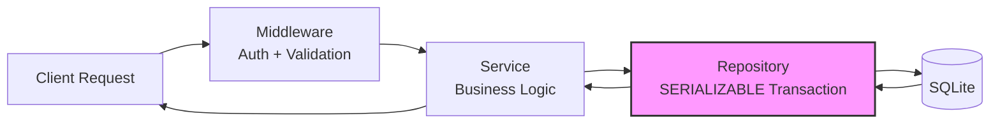
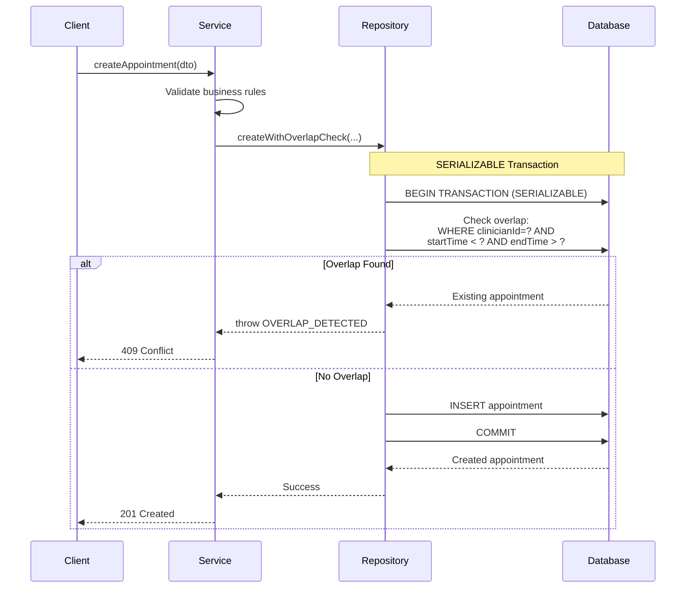
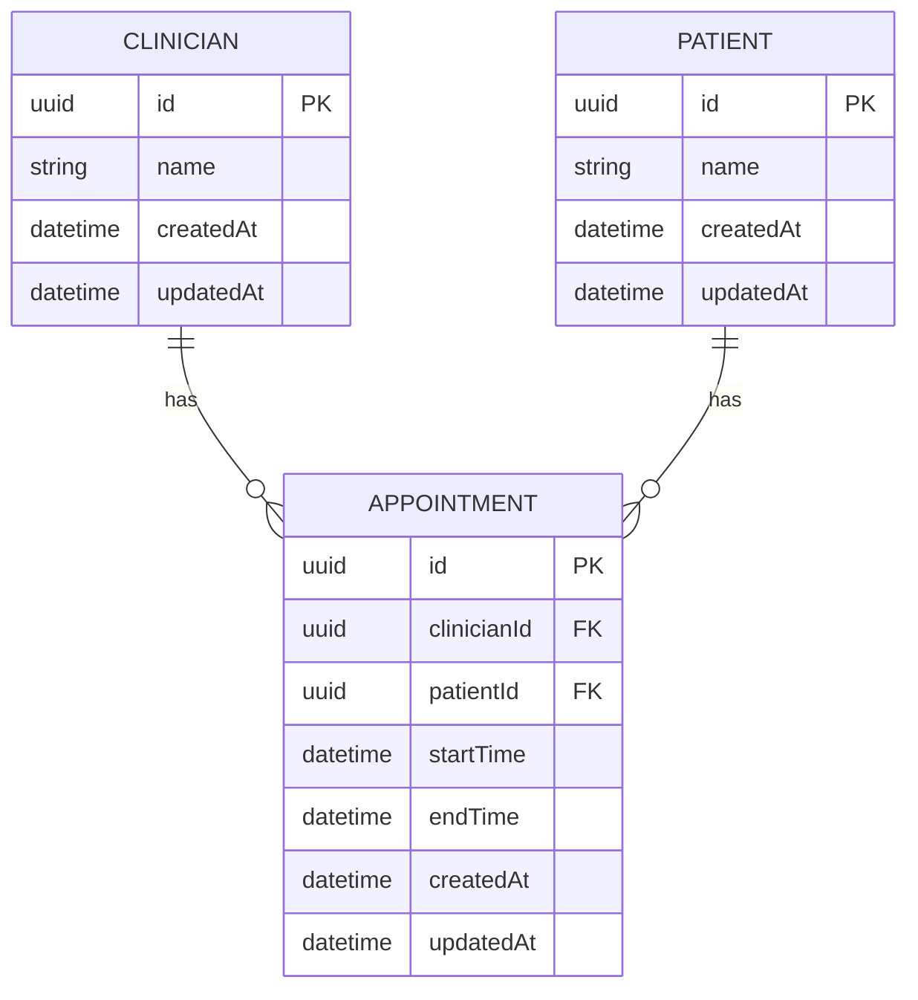

# Clinic Appointment System - Design Document

## Problem

Prevent overlapping appointments for the same clinician while maintaining data integrity under concurrent requests.

**Core Endpoints:**
- `POST /api/appointments` - Create with overlap validation
- `GET /api/clinicians/{id}/appointments` - View schedule (optional date filters)
- `GET /api/appointments` - Admin view (optional date filters)

**Constraints:**
- No overlapping appointments (touching endpoints allowed)
- Validate: `start < end`, ISO datetimes, entities exist, no past appointments
- Role-based access (patient/clinician/admin)
- 80%+ test coverage

## Solution

### Architecture



**Flow:** Request → Auth/Validation → Business Logic → **SERIALIZABLE Transaction** → Database

**Key:** Repository layer uses SERIALIZABLE transactions to prevent race conditions during overlap checks.

### Critical: Overlap Detection with SERIALIZABLE Transactions



**Why SERIALIZABLE matters**: Two concurrent requests both check for overlaps → SERIALIZABLE forces them to run sequentially → second request sees first appointment → conflict detected → no double-booking!

### Data Model



**ORM: Prisma**
- Type-safe database access
- Automatic TypeScript type generation
- Built-in migration support
- Transaction support with configurable isolation levels

**Key Schema Decisions:**
- **UUIDs** for primary keys (distributed-friendly)
- **Composite index** `(clinicianId, startTime, endTime)` for fast overlap queries
- **Cascade deletes** for referential integrity
- **Timestamps** auto-managed by Prisma

## Key Design Decisions

### 1. SERIALIZABLE Transactions

**Why:** Prevents race conditions where concurrent requests both see no overlap and create conflicting appointments.

**Trade-offs:**
- ✅ Simple, correct, database handles concurrency
- ❌ SQLite global write lock = limited throughput (~1000 writes/sec)

**Production:** Use PostgreSQL with `SELECT ... FOR UPDATE` (row-level locks, not global)

#### 2. Overlap Detection Algorithm

**Implementation:**
```typescript
// Two appointments overlap if:
start < other.end && end > other.start

// In Prisma query:
where: {
  clinicianId,
  AND: [
    { startTime: { lt: endTime } },    // other.start < our.end
    { endTime: { gt: startTime } },     // other.end > our.start
  ],
}
```

**Why this works:**
- Catches all overlap cases: partial, full containment, exact match
- Explicitly allows touching endpoints (end === other.start is OK)
- Database index on `(clinicianId, startTime, endTime)` makes this query O(log n)

**Edge Cases Covered:**
| Scenario | Appointment A | Appointment B | Result |
|----------|---------------|---------------|--------|
| Separate | 10:00-11:00 | 12:00-13:00 | ✅ Allowed |
| Touching (end to start) | 10:00-11:00 | 11:00-12:00 | ✅ Allowed |
| Touching (start to end) | 11:00-12:00 | 10:00-11:00 | ✅ Allowed |
| Partial overlap (start) | 10:00-11:00 | 10:30-11:30 | ❌ Rejected |
| Partial overlap (end) | 10:00-11:00 | 09:30-10:30 | ❌ Rejected |
| Fully contained | 10:00-12:00 | 10:30-11:00 | ❌ Rejected |
| Fully containing | 10:30-11:00 | 10:00-12:00 | ❌ Rejected |
| Exact match | 10:00-11:00 | 10:00-11:00 | ❌ Rejected |

#### 3. Role-Based Access Control

**Decision:** Simple header-based auth with `X-Role` header.

**Rationale:**
- Meets bonus requirement
- Easy to test and demonstrate
- Straightforward to extend to JWT later

**Trade-offs:**
- ✅ **Pro:** Simple, no JWT libraries, easy to understand
- ✅ **Pro:** Perfect for demo/assessment context
- ❌ **Con:** Not production-ready (no actual authentication)

**Role Matrix:**
| Endpoint | Patient | Clinician | Admin |
|----------|---------|-----------|-------|
| POST /appointments | ✅ | ❌ | ✅ |
| GET /appointments | ❌ | ❌ | ✅ |
| GET /clinicians/:id/appointments | ❌ | ✅ | ✅ |
| POST /clinicians | ❌ | ❌ | ✅ |
| POST /patients | ❌ | ❌ | ✅ |
| GET /clinicians | ✅ | ✅ | ✅ |
| GET /patients | ✅ | ✅ | ✅ |

#### 4. Validation & Error Handling

**Three-layer validation:**
1. **Schema (Zod)**: Type/format validation in middleware
2. **Business (Services)**: `start < end`, no past appointments, entities exist
3. **Database (Repository)**: Overlap detection in SERIALIZABLE transaction

**Error responses:** Consistent format with HTTP status codes (400/404/409/403)

**Dates:** ISO 8601 UTC strings, validated with date-fns

#### Database Indexing

**Composite index:** `(clinicianId, startTime, endTime)`

**Query optimization:**
```sql
-- Overlap query becomes an index-only scan
SELECT * FROM appointments
WHERE clinician_id = ?
  AND start_time < ?
  AND end_time > ?;
```

**Performance:**
- Without index: O(n) table scan
- With index: O(log n) B-tree lookup
- Typical overhead: <1ms for 10k appointments

### Frequently Asked Questions

#### Q: How does this handle race conditions?

**The problem:** Two requests try to book 10:00-11:00 simultaneously.

```
Time 0ms:  Request A starts transaction
Time 1ms:  Request B starts transaction
Time 5ms:  Request A checks for overlaps → finds NONE
Time 6ms:  Request B checks for overlaps → BLOCKED (SERIALIZABLE lock)
Time 10ms: Request A inserts appointment
Time 11ms: Request A commits
Time 12ms: Request B unblocks, re-checks → finds Request A's appointment
Time 13ms: Request B fails with OVERLAP_DETECTED
Time 14ms: Request B returns 409 Conflict
```

**Key:** SERIALIZABLE forces transactions to appear sequential, even if they run concurrently.

#### Q: Why not use optimistic locking instead?

**A:** Optimistic locking (version numbers) would work but adds complexity:
- Must manage version fields manually
- Application code handles conflicts
- Easy to miss edge cases

**Why SERIALIZABLE is simpler:**
- Database handles all concurrency logic
- No version field management
- Impossible to miss edge cases
- Sufficient for SQLite scale

**When to use optimistic locking:** PostgreSQL in production with high throughput (>1000 req/sec).

#### Q: What would change for production?

**Critical changes:**

1. **Database:** PostgreSQL with row-level locks (not global locks)
2. **Authentication:** JWT tokens instead of X-Role header
3. **Observability:** Structured logging (Pino), metrics (Prometheus), tracing (OpenTelemetry)
4. **Scaling:** Connection pooling, Redis caching, read replicas
5. **Security:** HTTPS/TLS, CORS policies, rate limiting

**Estimated effort:** ~2 weeks to production-ready.
